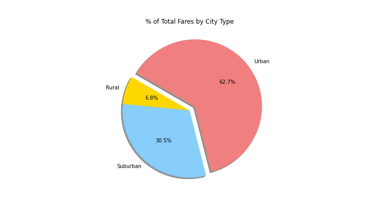
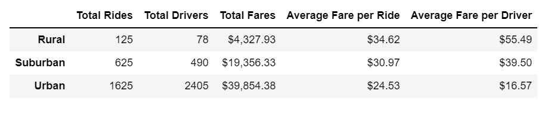
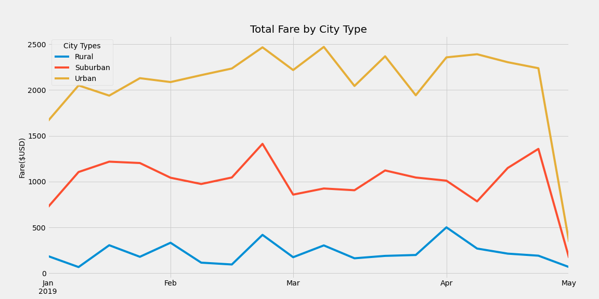

# PyBer_Analysis

## overview
This project is using the ridecompany data to conduct a market analysis to understand the consumer needs and trend.  

## Result

### Analysis by City Types
The charts below presented the relationship between city type and the total number of rides. It is obvious Ubban has a much higher demand.
  
  
  

## Summary

  

  

- Urban cities have most number of rides and total fare. It has a higher demand for riding services for future development to increase drivers.
- Rural cities have the leaset total number of rides and total fare, but highest average fare per ride and driver. Company can consider incentive program on for longer rides to attact more customer
- The suburban city type is the middle performing city type in the metrics. Company can consider combination of marketing and incentive programs to attact customer in this area. 